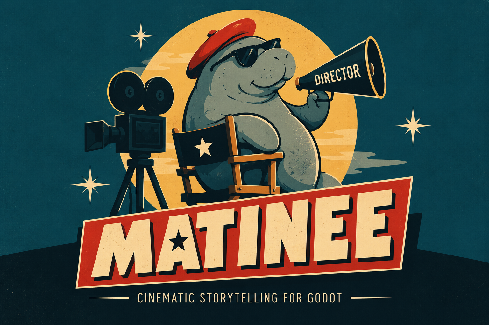

# Matinee



A native cinematic-authoring addon for **Godot 4.7+**.

Build sequences with a multi-track timeline, explicit clip timing, synchronized selection and Inspector, undo/redo, and visual and audio preview.

## Install

1. Copy `addons/matinee/` into your project.
2. Enable **Matinee** under **Project Settings > Plugins**.
3. Create and select a `MatineeSequence` resource.
4. Add tracks and actions, then enable **Runtime Preview** to preview supported clips.

All addon dependencies are contained in one folder. No autoloads or game assets are required for authoring and preview.

## Try it

Open this repository's `project.godot` and select `examples/welcome.tres`.

Matinee provides authoring and editor preview. Executing sequences in a running game requires a host playback controller; see [runtime integration](docs/RUNTIME_INTEGRATION.md). Camera preview currently shows diagnostics.

## Development

```powershell
python tools/package.py
python tools/package.py --test --godot "C:/path/to/Godot_console.exe"
```

The ZIP is written to `dist/`. Tests validate the packaged addon in a clean project.

[Contributing](docs/CONTRIBUTING.md) · [Architecture](docs/ARCHITECTURE.md) · [Testing](docs/TESTING.md) · [MIT License](LICENSE)
